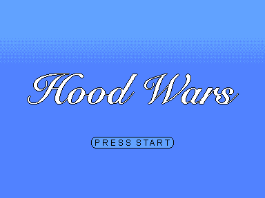

# Loop Wars

[](https://opensource.org/licenses/MIT)
[](https://www.typescriptlang.org/)
[](https://phaser.io/)
[](https://bun.sh/)
[](https://itch.io/jam/gmtk-2025)
[]()
[](https://github.com/yourusername/loop-wars)

A pixel-perfect action game built with modern web technologies. Loop Wars delivers precise movement mechanics and engaging gameplay in a retro-inspired package.



## Overview

Loop Wars is a top-down action game featuring:

- **Pixel-perfect graphics** rendered at native 384x288 resolution with 3x scaling
- **Responsive controls** with directional movement and facing mechanics
- **Custom physics system** optimized for arcade-style gameplay
- **Modular architecture** built with TypeScript and component-based design

## Technical Specifications

**Engine:** Phaser 3.85.0  
**Runtime:** Bun  
**Language:** TypeScript  
**Resolution:** 384x288 (3x scaled to 1152x864)  
**Physics:** Arcade Physics with custom collision system  

## Development

### Prerequisites

- [Bun](https://bun.sh) (latest version)
- Modern web browser with WebGL support

### Installation

```bash
git clone <repository-url>
cd loop-wars
bun install
```

### Development Server

```bash
bun run dev
```

The development server supports hot reloading and runs on `http://localhost:3000`.

### Production Build

```bash
bun run build
```

Builds are optimized for production and output to the `dist` directory.

## Architecture

### Core Systems

**Player Controller:** Modular player movement with state management and directional facing  
**Collision System:** Custom tile-based collision detection with sub-pixel precision  
**Asset Pipeline:** Streamlined asset loading with automatic sprite sheet processing  
**Scene Management:** Component-based scene architecture for maintainable game flow  

### Performance Optimizations

- Object pooling for dynamic entities
- Efficient collision detection with spatial partitioning  
- Asset compression and lazy loading
- Canvas renderer optimization for consistent performance

## Asset Workflow

The game includes a sophisticated asset pipeline supporting both manual and automated workflows:

### Collision Data Export

```bash
# Export collision data from Aseprite files
bun run export:collision filename.aseprite
bun run export:collision:all
```

### Asset Organization

```
public/assets/
├── images/           # Game visuals
│   ├── levels/       # Level backgrounds  
│   ├── sprites/      # Character sprites
│   └── ui/           # Interface elements
├── collision/        # Generated collision data
└── aseprite/         # Source art files
```

## Code Quality

The codebase maintains strict TypeScript standards with:

- **Type safety:** Full TypeScript coverage with strict compilation
- **Modular design:** Component-based architecture for maintainability  
- **Performance focus:** Optimized update loops and memory management
- **Clean separation:** Game logic isolated from rendering and input systems

## Browser Compatibility

**Recommended:** Chrome, Firefox, Safari (latest versions)  
**Minimum:** Any browser with WebGL 1.0 support  
**Mobile:** Touch controls supported on mobile devices

## License

MIT License - see LICENSE file for details.
